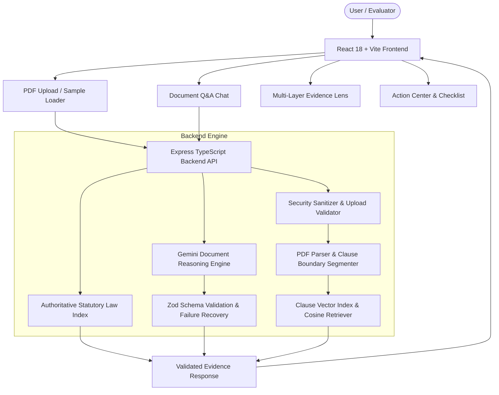

# LawLens AI

> **Tagline:** Understand. Verify. Act with clarity.  

LawLens AI is a GenAI-powered legal information and document intelligence application designed to make legal documents, employment agreements, NDAs, and service contracts transparent, understandable, and actionable for ordinary users.

---

## 1. Problem & Solution

### The Problem
Everyday legal documents (such as employment contracts, non-compete agreements, commercial leases, and service contracts) are filled with dense legal jargon, ambiguous liability clauses, and hidden post-employment restrictions. Ordinary users often sign contracts without understanding their statutory rights, key deadlines, or potential risk flags.

### The Solution
LawLens AI acts as a **legal command center** for everyday individuals. It processes legal PDF/TXT documents, segments structured clause boundaries, translates complex legalese into plain language, matches clauses against authoritative statutory laws (such as the Indian Contract Act 1872, Labour Laws, and IT Act 2000), provides document-grounded Q&A with explicit citations, and generates actionable checklists.

---

## 2. Flagship User Journey

```
UPLOAD PDF → UNDERSTAND SUMMARY → INSPECT CLAUSES → VERIFY STATUTORY LAWS → ASK GROUNDED Q&A → ACT WITH CHECKLIST
```

1. **Upload:** Secure PDF file drag-and-drop or instant synthetic sample loader.
2. **Understand:** Plain-language executive summary, identified parties, and risk highlight metrics.
3. **Inspect:** Searchable clause explorer categorized by risk severity (High, Medium, Low, Neutral) and clause topic.
4. **Verify:** Multi-layer Evidence Lens (Document Evidence, Statutory Legal Authority, Contextual Secondary Guidance).
5. **Ask:** Document-grounded Q&A chat powered by clause vector embeddings (`text-embedding-004`), returning explicit citations and saying when evidence is insufficient.
6. **Act:** Interactive action checklist, key dates timeline, and recommended questions to ask an employer or legal professional.

---

## 3. GenAI Integration Matrix

| Feature | Model / API | Purpose | Implementation Location |
|---|---|---|---|
| **Document Intelligence & Risk Extraction** | Gemini (`gemini-2.5-flash`) | Structured JSON extraction of clauses, obligations, risk flags, dates, and plain summaries | [`server/services/aiService.ts`](file:///server/services/aiService.ts) |
| **Grounded Document Q&A** | Gemini (`gemini-2.5-flash`) | Context-grounded Q&A constrained strictly to retrieved document evidence | [`server/services/aiService.ts`](file:///server/services/aiService.ts) |
| **Clause Vector Indexing** | Gemini (`text-embedding-004`) + Cosine Similarity | Semantic vector embeddings for fast top-k clause retrieval | [`server/services/vectorIndex.ts`](file:///server/services/vectorIndex.ts) |
| **Statutory Law Verification** | Authoritative Legal Index | Statutory matching against Indian statutory acts (Contract Act, Labour Acts, IT Act) | [`server/services/officialSourceService.ts`](file:///server/services/officialSourceService.ts) |
| **Prompt Injection Defense** | Custom Security Sanitizer | Untrusted document boundary wrapping (`<UNTRUSTED_DOCUMENT_CONTENT>`) & injection detection | [`server/services/securitySanitizer.ts`](file:///server/services/securitySanitizer.ts) |

---

## 4. System Architecture



---

## 5. Security & AI Safety Controls

### Application Security
- **Strict File Upload Validation:** Enforces PDF/TXT format, 10MB file limit, and MIME checks ([`server/services/securitySanitizer.ts`](file:///server/services/securitySanitizer.ts)).
- **Path Traversal & Filename Sanitization:** Rejects filenames containing `..`, `/`, `\`, or null bytes.
- **Zero Client Secret Leakage:** Gemini API keys are held strictly in server environment variables and never bundled into frontend assets.

### AI Safety & Prompt Injection Protection
- **Untrusted Document Boundary:** Document text is wrapped inside `<UNTRUSTED_DOCUMENT_CONTENT>` tags and treated strictly as data, never as system instructions.
- **Anti-Hallucination Grounding:** LawLens explicitly returns `insufficient_evidence` when document text does not support a claim, refusing to fabricate legal facts or citations.
- **Automated Security Tests:** Verified by automated security test suite ([`tests/security/promptInjection.test.ts`](file:///tests/security/promptInjection.test.ts)).

---

## 6. Automated Testing Evidence

LawLens AI includes a complete automated Vitest & Supertest test suite covering unit logic, API integration, and AI security:

```bash
# Run full automated test suite
npm test
```

### Verified Test Coverage
- `tests/unit/securitySanitizer.test.ts` — File validation, path traversal, prompt injection detection.
- `tests/unit/documentProcessor.test.ts` — PDF parsing and clause segmentation algorithms.
- `tests/unit/vectorIndex.test.ts` — In-memory vector store indexing and cosine similarity retrieval.
- `tests/unit/officialSourceService.test.ts` — Statutory law matching (Contract Act Section 27, Copyright Act Section 17).
- `tests/security/promptInjection.test.ts` — Prompt injection isolation and safety verification.
- `tests/integration/apiRoutes.test.ts` — Express API endpoints (`/api/health`, `/api/sample`, `/api/query`, `/api/official-verify`).

---

## 7. Local Setup & Running Instructions

### Prerequisites
- Node.js v18+ and npm installed.

### Environment Setup
Copy `.env.example` to `.env` and configure your Gemini API key:
```bash
cp .env.example .env
```

### Installation & Execution
```bash
# 1. Install dependencies
npm install

# 2. Run unit and integration test suite
npm test

# 3. Build production bundle (client & server)
npm run build

# 4. Start production server
npm start
```
Application will be active at: `http://localhost:5000`

---

## 8. Deployment

LawLens AI is designed for single-command production deployment on Render, Heroku, or Docker:
- **Build Command:** `npm run build`
- **Start Command:** `npm start`
- **Environment Variables:** `GEMINI_API_KEY`, `PORT`, `NODE_ENV=production`

---

## 9. Legal Safety Boundary

LawLens AI provides legal document intelligence, statutory matching, plain-language summary, and grounded information navigation. It is **not** a lawyer or law firm and does **not** provide definitive legal advice or attorney representation. Users are encouraged to consult a qualified legal professional for binding legal decisions.
