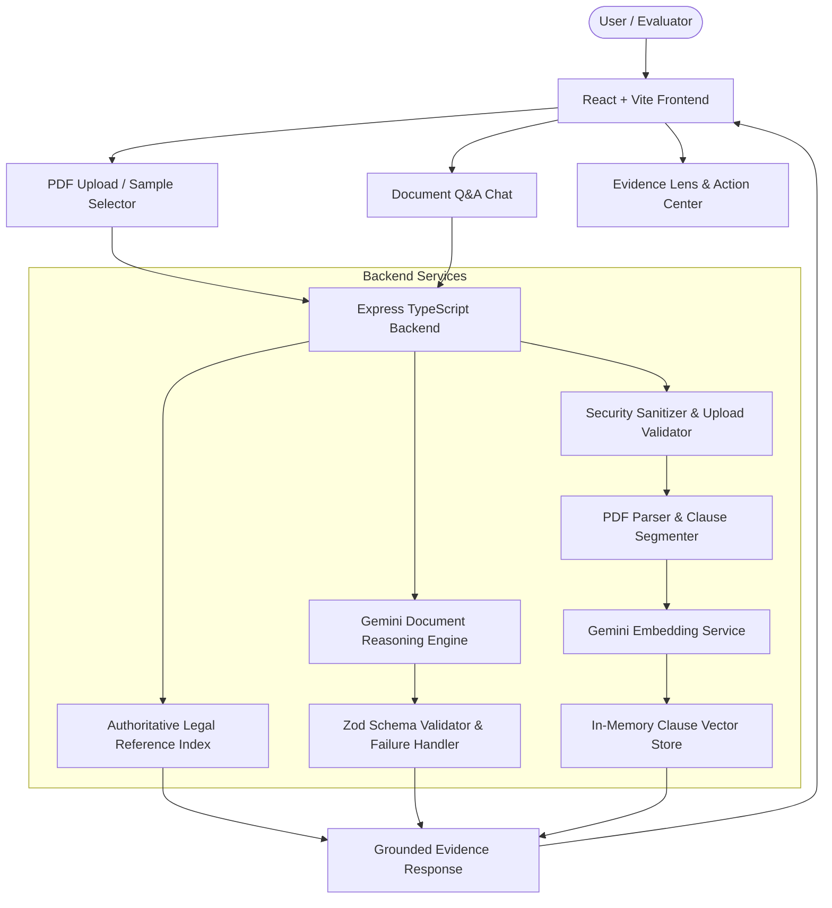

# LawLens AI — Architecture & Implementation Plan

> **Project:** LawLens AI (Google Virtual PromptWars 2026 — Exclusive Extra Insider Challenge)  
> **Tagline:** Understand. Verify. Act with clarity.  
> **Target Goal:** Build a fully working, grounded, secure, evaluator-visible GenAI legal document intelligence application.

---

## 1. Primary Architecture Overview

LawLens AI follows a clean, single-tier fullstack TypeScript architecture (Node.js + Express backend + React/Vite frontend) designed for deterministic deployment on Render or Docker.

---

## 2. Evidence Pipeline

LawLens AI strictly separates three layers of evidence to ensure anti-hallucination and evaluator transparency:

1. **Layer 1 — Document Evidence:** Exact text excerpts extracted from the uploaded PDF with section index and title.
2. **Layer 2 — Official Authority:** Authoritative statutory provisions (e.g., Indian Contract Act 1872, Industrial Disputes Act, Shops & Establishments Acts, IT Act 2000, Consumer Protection Act 2019) mapped to relevant clauses.
3. **Layer 3 — Contextual Information:** Reputable guidance and practical standards clearly marked as secondary/contextual.

---

## 3. Phased Implementation Roadmap

### Phase 1: Project Foundation & Environment Setup
- Initialize package.json, TypeScript configs (server & client), Vite build setup, Tailwind CSS design tokens.
- Configure `.env.example`, `.gitignore`, and project scripts (`npm run dev`, `npm run build`, `npm test`, `npm start`).

### Phase 2: Core Document Processing & Security Layer
- File validation (PDF format, MIME check, 10MB limit, filename sanitization).
- PDF text extraction & clause segmentation algorithm.
- Prompt injection defense layer (detecting instructions in document text and isolating content inside strict delimiters).

### Phase 3: Gemini GenAI Document Intelligence Service
- Gemini integration using `@google/genai` (with fallback to `@google/generative-ai` or structured JSON mock when offline/testing).
- Structured output schemas (Zod) for document summary, clause analysis, risk flags, obligations, key dates, and questions.

### Phase 4: Lightweight RAG & Semantic Retrieval
- Clause embedding generation using `text-embedding-004`.
- In-memory vector index with cosine similarity retrieval for document-grounded Q&A.
- Insufficient evidence detection (refusing to answer when document lacks evidence).

### Phase 5: Authoritative Legal Knowledge & Evidence Lens
- Legal reference database covering Indian statutory laws (Contract Act, Labour Laws, IP/IT Act, Lease/Rent laws).
- Multi-layer evidence classification (Document, Official, Contextual).

### Phase 6: High-Polish React UI & Action Center
- Responsive UI shell with dark/light themes and English / Hindi / Hinglish translation support.
- Interactive workflow: Upload → Understand → Inspect → Verify → Ask → Act.
- Pre-loaded synthetic sample legal documents for instant evaluator testing.

### Phase 7: Automated Test Suite
- Unit tests: PDF parsing, prompt injection defense, vector retrieval, schema validation.
- Integration tests: Express API routes (`/api/upload`, `/api/analyze`, `/api/query`, `/api/official-verify`, `/api/health`).
- Security test suite: Malicious prompt injection files, malformed documents, secret exposure checks.

### Phase 8: Documentation & Evaluator Audit
- Complete README.md with actual architecture, AI model table, test commands, security controls, and deployment steps.
- Update `docs/state/project-state.md` and run `/evaluator-audit`.

---

## 4. Verification Plan
- `npm run test`: All unit, integration, and security tests pass.
- `npm run build`: Clean TypeScript compilation and Vite bundle without errors.
- Manual test with synthetic sample PDFs (Employment Contract, Freelance Agreement, Commercial Lease).
- Evaluator readiness review against Google PromptWars rules.
